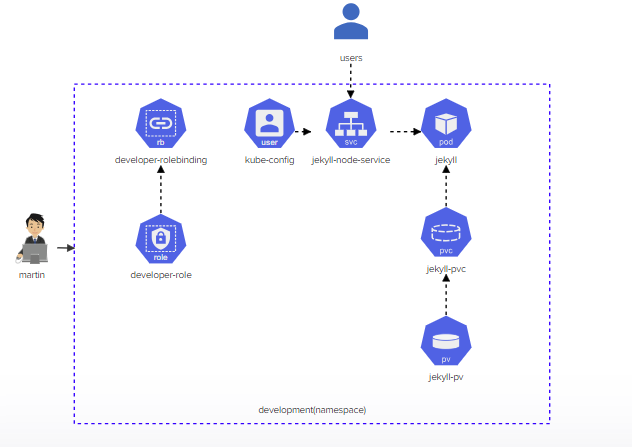

# Challenge 1 - Deploy Jekyll Static Site Generator (SSG)

This is my solution for the first challenge of the Kodekloud Kubernetes (K8s) challenges. The goal was to deploy the given architecture diagram for implementing a Jekyll Static Site Generator (SSG).

find the lab [here](https://kodekloud.com/topic/lab-kubernetes-challenge-1/)

## Architecture Diagram

The architecture diagram for this challenge can be found in the `K8S-challenge.png` file.



## Solution

To deploy the Jekyll SSG, I created the following Kubernetes manifest files:

- `role.yaml`: A Kubernetes Role manifest file that defines the permissions for `martin` .

- `role-binding.yaml`: A Kubernetes RoleBinding manifest file that binds the `martin` user to the `martin` Role.

- `jekyll-node-service.yaml`: A Kubernetes Service manifest file that exposes the Jekyll node app on a NodePort.

- `jekyll-pvc`: A Kubernetes PersistentVolumeClaim manifest file that defines the persistent volume for the Jekyll app.

- `jekyll-pod.yaml`: A Kubernetes Pod manifest file that defines the Jekyll app container.

Then, I ran the following commands to accomplish the following:

- Set the credentials for user `martin`
    ```bash
    kubectl config set-credentials martin --client-key=martin.key --client-certificate=martin.crt
    ```
- Create context for the Kubernetes cluster with user `martin` and cluster `kubernetes`
    ```bash
    kubectl config set-context developer --user=martin --cluster kubernetes
    ```
- Set the current context to `developer`
    ```bash
    kubectl config use-context developer
    ```

## Architecture Diagram Solution

This is the diagram after providing the right solution


