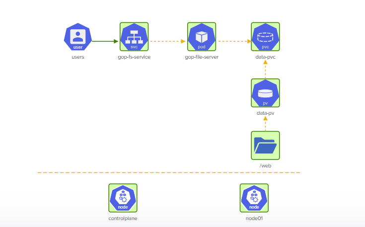

# Challenge 2 - Troubleshooting and Deploying Objects on a 2-Node Kubernetes Cluster

This directory contains the solution to the Challenge 2 of the KodeKloud Kubernetes Challenges. The challenge consists of troubleshooting and fixing a broken 2-Node Kubernetes cluster and deploying objects based on the given architecture diagram.

find the lab [here](https://kodekloud.com/topic/lab-kubernetes-challenge-2/)

## Architecture Diagram

The architecture diagram for this challenge can be found in the `challenge2-arch.png` file.


## Solution

To fix the issues with the controlplane node, I performed the following steps:

1. Before we can execute any `kubectl` commands, we must fix the kubeconfig. The server port is incorrect and should be `6443`. Edit this in `vim` and save.

        ```bash
        vim .kube/config
        ```
 Change the port and set it to the correct port `6443`, save and exit vim.
 
2. Replaced `ca-authority.crt` with `ca.crt `in the `kube-apiserver` manifest file:
        ```bash
        vim /etc/kubernetes/manifests/kube-apiserver.yaml
        ```

        Change the following line to refer to the correct certificate file, save and exit vim.

        ```yaml
            - --client-ca-file=/etc/kubernetes/pki/ca-authority.crt
        ```
    as there is no ca-authority.crt file in /etc/kubernetes/pki directory

3. Restarted the kubelet service using this command:
    ```bash
    systemctl restart kubelet
    ```

4. Fix the image of the `coredns` deployment

```bash
kubectl edit deployment -n kube-system coredns
```
and change the image to ``registry.k8s.io/coredns/coredns:v1.8.6``

Fix `node01` node by Allowing scheduling of pods on it

```bash
kubectl uncordon node01
```

Finally, I copied all images from the `/media` directory on the `controlplane` node to the `/web` directory on `node01` 

```bash
scp /media/* node01:/web
```

The following files were used to deploy the Kubernetes objects:

- `data-pv.yaml`: YAML file to define the Persistent Volumes for storing the image data.
- `data-pvc.yaml`: YAML file to define the Persistent Volume Claims for the image data.
- `gop-file-server-pod.yaml`: YAML file to define the file server pod that serves the image data.
- `gop-fs-service.yaml`: YAML file to define the service that exposes the file server pod.
## Architecture Diagram Solution

This is the diagram after providing the right solution

