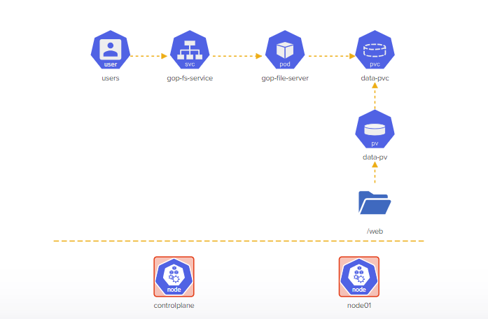

# Challenge 2 - Troubleshooting and Deploying Objects on a 2-Node Kubernetes Cluster

This directory contains the solution to Challenge 2 of the KodeKloud Kubernetes Challenges. The challenge involves troubleshooting and fixing a broken 2-Node Kubernetes cluster, followed by deploying objects based on the provided architecture diagram.

Access the lab instructions [here](https://kodekloud.com/topic/lab-kubernetes-challenge-2/).

## Architecture Diagram

Refer to the architecture diagram in the `challenge2-arch.png` file:



## Troubleshooting and Solution Steps

### Controlplane Node

1. **Fixing Kubeconfig:**
    Before executing any `kubectl` commands, correct the kubeconfig file. Edit it using:

    ```bash
    vim .kube/config
    ```
    Change the server port to `6443`, save, and exit vim.

2. **Update `kube-apiserver` Manifest:**
    Replace `ca-authority.crt` with `ca.crt` in the `kube-apiserver` manifest file:

    ```bash
    vim /etc/kubernetes/manifests/kube-apiserver.yaml
    ```
    Update the following line to refer to the correct certificate file, then save and exit vim.

    ```yaml
    - --client-ca-file=/etc/kubernetes/pki/ca-authority.crt
    ```
    Note: There is no `ca-authority.crt` file in the `/etc/kubernetes/pki` directory.

3. **Restart kubelet Service:**
    Restart the kubelet service:

    ```bash
    systemctl restart kubelet
    ```

### CoreDNS Deployment

4. **Fix `coredns` Deployment Image:**
    Edit the `coredns` deployment:

    ```bash
    kubectl edit deployment -n kube-system coredns
    ```
    Change the image to `registry.k8s.io/coredns/coredns:v1.8.6`.

### Node01 Node

5. **Allow Scheduling on `node01`:**
    Enable scheduling of pods on `node01`:

    ```bash
    kubectl uncordon node01
    ```

6. **Copy Images from Controlplane to Node01:**
    Copy all images from `/media` on the controlplane node to `/web` on `node01`:

    ```bash
    scp /media/* node01:/web
    ```

## Kubernetes Object Deployment

The following YAML files were used to deploy Kubernetes objects:

- `data-pv.yaml`: Persistent Volumes definition for storing image data.
- `data-pvc.yaml`: Persistent Volume Claims definition for image data.
- `gop-file-server-pod.yaml`: Pod definition for the file server serving image data.
- `gop-fs-service.yaml`: Service definition exposing the file server pod.

## Architecture Diagram - After Solution

View the updated architecture diagram post-solution:


