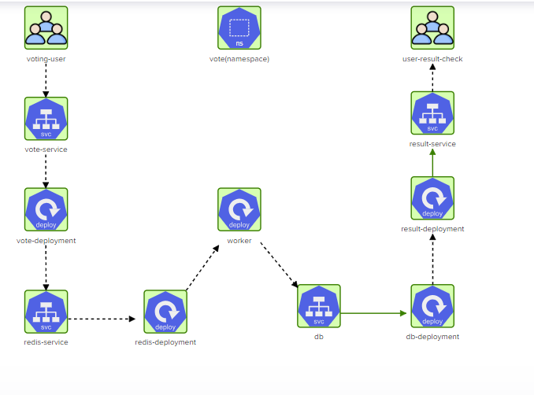

# Challenge 3 - Deploying the Voting App in Kubernetes

This challenge involves deploying the Voting App on a Kubernetes cluster using the YAML files provided in this directory. 

## Architecture Diagram

The architecture diagram for the Voting App can be found in the `challenge-3-arch.png` file. The app components are deployed in the `vote` namespace.


## Solution

To deploy the Voting App, follow these steps:

1. Create the `vote` namespace by running the following command:
   
   ```bash
   kubectl apply -f vote-namespace.yaml
   ```
2. Deploy the `vote` application by running the following command:
   
   ```bash
   kubectl apply -f vote-deployment.yaml
   ```
   This will create a deployment for the `vote` application.

3. Expose the `vote` deployment by running the following command:
   
   ```bash
   kubectl apply -f vote-svc.yaml
   ```
   This will create a service that exposes the `vote` deployment.

4. Deploy the `redis` application by running the following command:
   
   ```bash
   kubectl apply -f redis-deployment.yaml
   ```
   This will create a deployment for the `redis` application.

5. Expose the `redis` deployment by running the following command:
   
   ```bash
   kubectl apply -f redis-svc.yaml
   ```
   This will create a service that exposes the `redis` deployment.

6. Deploy the `worker` application by running the following command:
   
   ```bash
   kubectl apply -f worker-deployment.yaml
   ```
   This will create a deployment for the `worker` application.

7. Deploy the `db` application by running the following command:
   
   ```bash
   kubectl apply -f db-deployment.yaml
   ```
   This will create a deployment for the `db` application.

8. Expose the `db` deployment by running the following command:
   
   ```bash
   kubectl apply -f db-svc.yaml
   ```
   This will create a service that exposes the `db` deployment.

9. Deploy the `result` application by running the following command:
   
   ```bash
   kubectl apply -f result-deployment.yaml
   ```
   This will create a deployment for the `result` application.

10. Expose the `result` deployment by running the following command:
    
    ```bash
    kubectl apply -f result-svc.yaml
    ```
    This will create a service that exposes the `result` deployment.

## Architecture Diagram - After Solution

View the updated architecture diagram post-solution:

