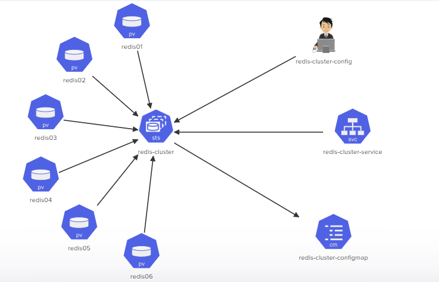

# Challenge 4 - Building a Highly Available Redis Cluster

This solution aims to build a highly available Redis cluster based on the given architecture diagram using Kubernetes.

## Architecture Diagram

The architecture diagram for this challenge can be found in the `challenge4-arch.png` file.



## Solution

The solution is structured as follows:

- `redis01.yaml`: A YAML file that defines the Kubernetes Persistent Volumes of redis01.
- `redis02.yaml`: A YAML file that defines the Kubernetes Persistent Volumes of redis02.
- `redis03.yaml`: A YAML file that defines the Kubernetes Persistent Volumes of redis03.
- `redis04.yaml`: A YAML file that defines the Kubernetes Persistent Volumes of redis04.
- `redis05.yaml`: A YAML file that defines the Kubernetes Persistent Volumes of redis05.
- `redis06.yaml`: A YAML file that defines the Kubernetes Persistent Volumes of redis06.
- `redis-cluster-StatefulSet.yaml`: A YAML file that defines the Redis cluster stateful set.
- `redis-cluster-svc.yaml`: A YAML file that defines the Redis cluster service.


## Deployment Steps

1. Open a terminal and navigate to the manifests directory.
2. Apply the Persistent Volumes configuration:

    ```bash
    kubectl apply -f redis01.yaml
    ```

    ```bash
    kubectl apply -f redis02.yaml
    ```

    ```bash
    kubectl apply -f redis03.yaml
    ```

    ```bash
    kubectl apply -f redis04.yaml
    ```

    ```bash
    kubectl apply -f redis05.yaml
    ```

    ```bash
    kubectl apply -f redis06.yaml
    ```

3. Deploy the Redis Cluster service:

    ```bash
    kubectl apply -f redis-cluster-svc.yaml
    ```
4. Deploy the Redis Cluster stateful set:

    ```bash
    kubectl apply -f redis-cluster-StatefulSet.yaml
    ```
5. Initialize the Redis Cluster by running the following command:

    ```bash
    kubectl exec -it redis-cluster-0 -- redis-cli --cluster create --cluster-replicas 1 $(kubectl get pods -l app=redis-cluster -o jsonpath='{range.items[*]}{.status.podIP}:6379 {end}')a
    ```
## Architecture Diagram - After Solution

View the updated architecture diagram post-solution:

