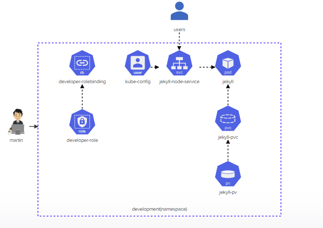
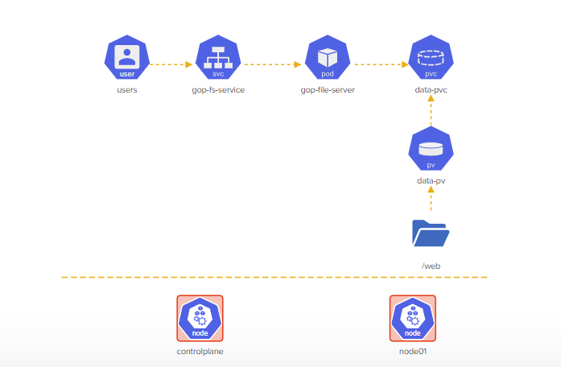
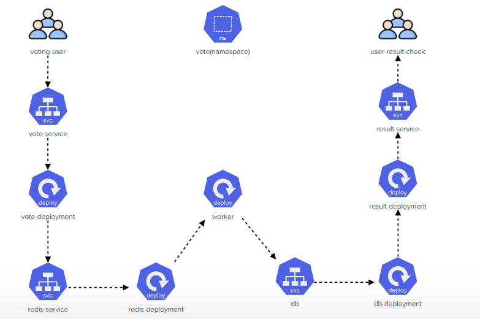
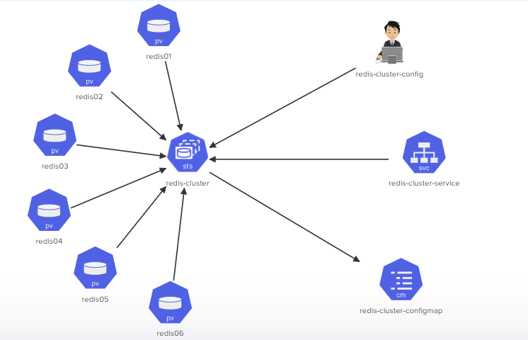

# Kodekloud Kubernetes Challenges

This repository contains my solutions for the [Kodekloud Kubernetes challenges](https://kodekloud.com/courses/kubernetes-challenges/). Each challenge requires you to apply your knowledge of Kubernetes to solve a problem or implement a specific architecture.

## Challenges

The repository contains the following challenges:

1. **Challenge 1**: [Deploy Jekyll SSG](https://kodekloud.com/topic/lab-kubernetes-challenge-1/)
    - **_Description_**: Deploy the given architecture diagram for implementing a `Jekyll SSG`.
    - **_Solution_**: [challenge-1](./KUBERNETES-CHALLENGE-1)
    - **_Architecture_**: 

        

2. **Challenge 2**: [Troubleshooting and Deploying Objects](https://kodekloud.com/topic/lab-kubernetes-challenge-2/)
    - **_Description_**: troubleshooting and fixing a broken 2-Node Kubernetes cluster and deploying objects based on the given architecture diagram.
    - **_Solution_**: [challenge-2](./KUBERNETES-CHALLENGE-2)
    - **_Architecture_**:

        

3. **Challenge 3**: [Voting App](https://kodekloud.com/topic/lab-kubernetes-challenge-3/)
    - **_Description_**: Deploying the Voting App on a Kubernetes cluster.
    - **_Solution_**: [challenge-3](./KUBERNETES-CHALLENGE-3)
    - **_Architecture_**: 

        
        
4. **Challenge 4**: [Redis Cluster](https://kodekloud.com/topic/lab-kubernetes-challenge-4/)
    - **_Description_**: Build a highly available Redis cluster.
    - **_Solution_**: [challenge-4](./KUBERNETES-CHALLENGE-4)
    - **_Architecture_**:

        
